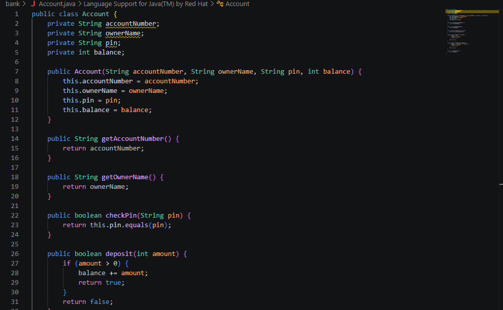
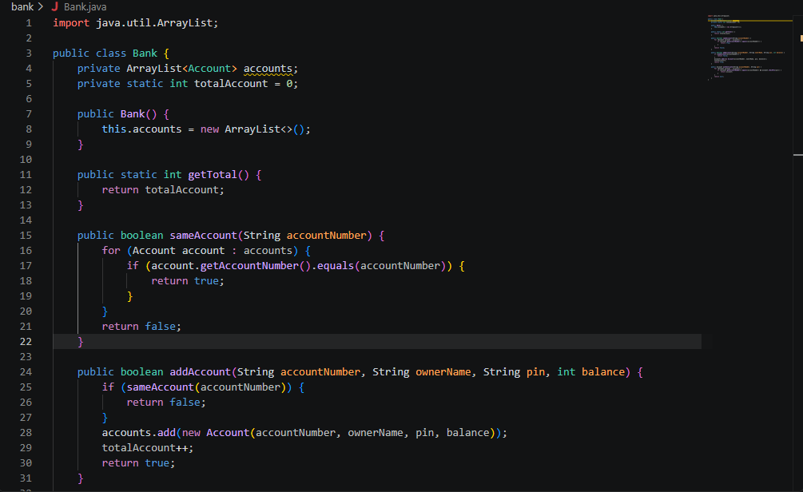
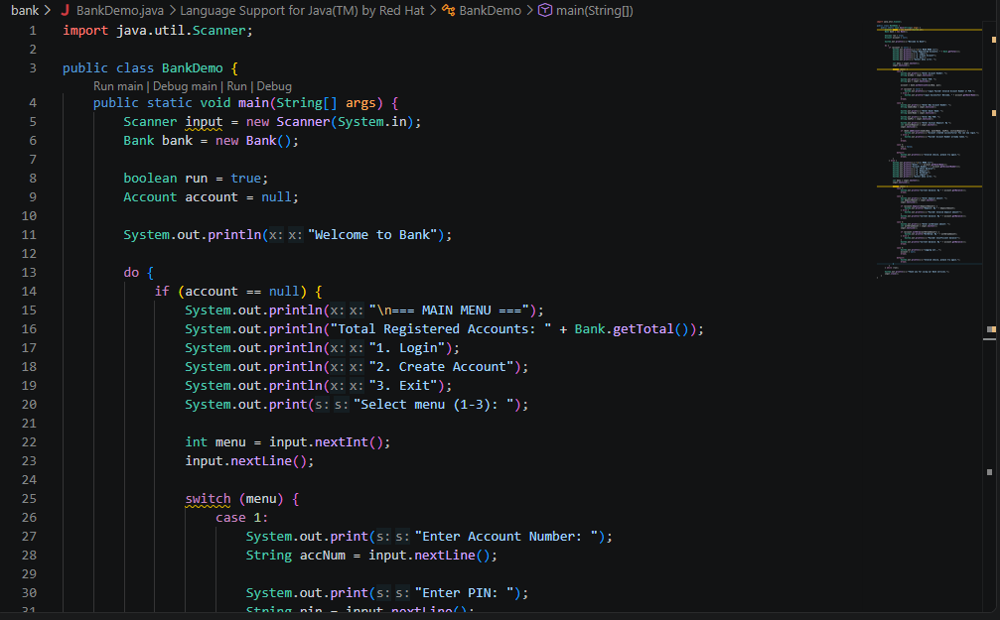
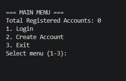
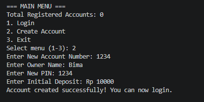
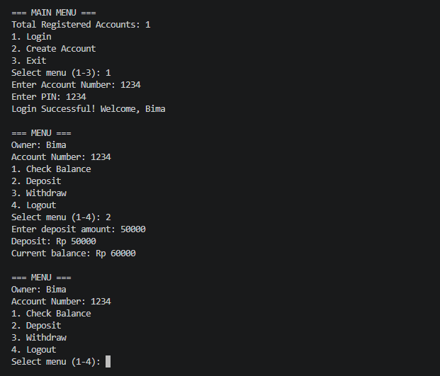

# Bank Account Management System (Console)

A console-based Java application that simulates a basic banking system. The program allows users to create accounts, log in with credentials, inspect account balances, deposit money, and withdraw funds. This project was developed as an assignment for the Object-Oriented Programming (PBO) course, focusing on **ArrayList** for in-memory data management, **encapsulation**, and **static members**.

All account data is maintained in runtime memory inside an `ArrayList<Account>` and will reset when the application terminates.

## Project Structure

```text
bank/
├── assets/
│   ├── account-code.png
│   ├── bank-code.png
│   ├── bankdemo-code.png
│   ├── main-menu.png
│   ├── create-account.png
│   └── transactions.png
├── Account.java
├── Bank.java
├── BankDemo.java
└── README.md
```

## Additional Information & Dependencies

This application uses standard **Java SE (Standard Edition)** libraries and does not require third-party dependencies, build tools (Maven/Gradle), or external JAR files.

Standard libraries utilized:
- `java.util.Scanner`: Handles console input operations in `BankDemo.java`.
- `java.util.ArrayList`: Dynamically manages the collection of `Account` objects in `Bank.java`.

## Code Explanation

### `Account.java`

<p align="center">
  
  <br>
  <em>Account.java source code</em>
</p>

`Account` represents an individual bank account entity.

- **Attributes:**
  - `accountNumber`, `ownerName`, `pin`: Stored as `private String`.
  - `balance`: Stored as `private int`.
- **Constructor:** Initializes the account with the provided account number, owner name, security PIN, and opening balance.
- **`getAccountNumber()` & `getOwnerName()`:** Getter methods providing read-only access to account identifiers.
- **`checkPin(String pin)`:** Compares the supplied PIN with the stored PIN using `.equals()`. This keeps the PIN string encapsulated without exposing it to outside classes.
- **`deposit(int amount)`:** Validates that the deposited value is greater than zero. If valid, adds to `balance` and returns `true`; otherwise returns `false`.
- **`withdraw(int amount)`:** Checks if the amount is positive and does not exceed the current balance (`amount <= balance`). Deducts from `balance` and returns `true`, or returns `false` if funds are insufficient.
- **`getBalance()`:** Getter method returning the current balance.

### `Bank.java`

<p align="center">
  
  <br>
  <em>Bank.java source code</em>
</p>

`Bank` acts as the manager for the collection of active accounts.

- **Attributes:**
  - `accounts`: An `ArrayList<Account>` storing registered account instances.
  - `totalAccount`: A `private static int` that counts total accounts created across the system.
- **Constructor:** Instantiates an empty `ArrayList<Account>`.
- **`getTotal()`:** A `public static int` method exposing `totalAccount`.
- **`sameAccount(String accountNumber)`:** Iterates through `accounts` to check whether an account number already exists in the system.
- **`addAccount(String accountNumber, String ownerName, String pin, int balance)`:** Validates account uniqueness using `sameAccount()`. If unique, instantiates a new `Account`, appends it to `accounts`, increments `totalAccount`, and returns `true`. Returns `false` if the account number is already registered.
- **`authenticate(String accountNumber, String pin)`:** Loops through the account list to locate an entry matching both the account number and `account.checkPin(pin)`. Returns the matched `Account` instance if verified, or `null` if verification fails.

### `BankDemo.java`

<p align="center">
  
  <br>
  <em>BankDemo.java source code</em>
</p>

`BankDemo` serves as the entry point and terminal user interface.

- **`main()`:** Instantiates `Scanner` and `Bank`. It uses a `boolean run` flag inside a `do-while` loop to control application execution.
- **State Navigation:**
  - **Main Menu (`account == null`):**
    - Displays `Bank.getTotal()` to show registered account count.
    - **1. Login:** Requests credentials and executes `bank.authenticate()`. If successful, sets the active `account`.
    - **2. Create Account:** Collects new account data and invokes `bank.addAccount()`.
    - **3. Exit:** Sets `run = false` to terminate the loop.
  - **Transaction Menu (`account != null`):**
    - **1. Check Balance:** Outputs `account.getBalance()`.
    - **2. Deposit:** Prompts for nominal value, runs `account.deposit()`, and shows the updated balance.
    - **3. Withdraw:** Prompts for nominal value, runs `account.withdraw()`, and alerts if the balance is insufficient.
    - **4. Logout:** Resets `account = null` to switch back to the Main Menu.

## Concepts Demonstrated

- **Encapsulation:** Sensitive fields (`pin`, `balance`) are marked `private` and manipulated through validation methods (`deposit`, `withdraw`, `checkPin`).
- **Static Variables & Methods:** `totalAccount` and `getTotal()` belong to the `Bank` class directly to maintain a global counter for all accounts created.
- **Collections Framework (ArrayList):** Dynamic storage via `ArrayList<Account>` allows adding and looking up accounts without fixed array constraints.

## Program Output

### 1. Main Menu
Displays the initial screen with options to login, register, or exit, along with the total registered accounts.

<p align="center">
  
  <br>
  <em>Main Menu Interface</em>
</p>

### 2. Create Account
Demonstrates the account registration flow with successful confirmation.

<p align="center">
  
  <br>
  <em>Account Registration Flow</em>
</p>

### 3. Login & Transactions
Demonstrates a successful login session followed by balance inquiry, deposit, and withdrawal operations.

<p align="center">
  
  <br>
  <em>Authenticated Dashboard and Transactions</em>
</p>