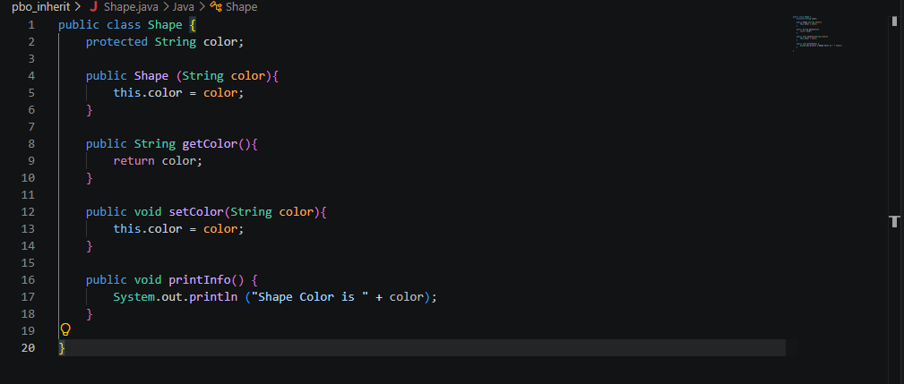
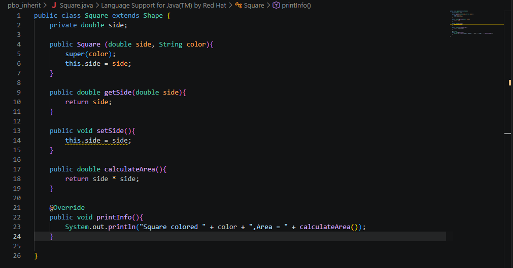
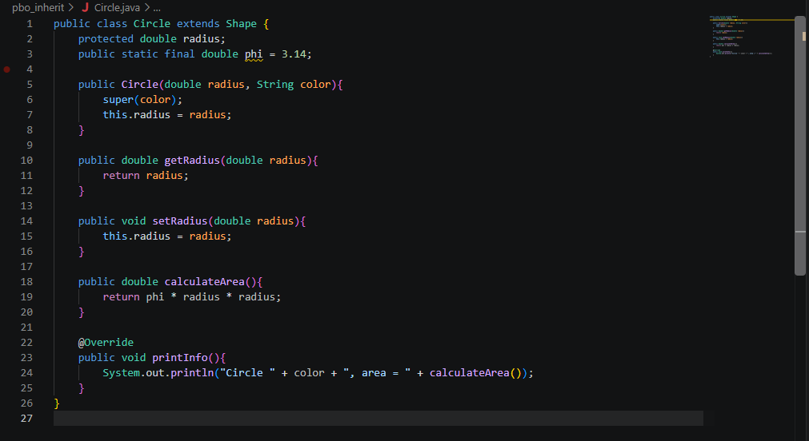
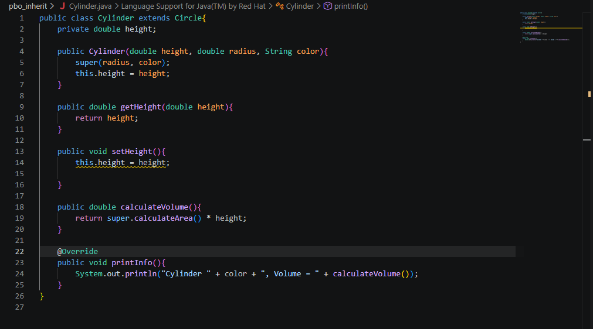
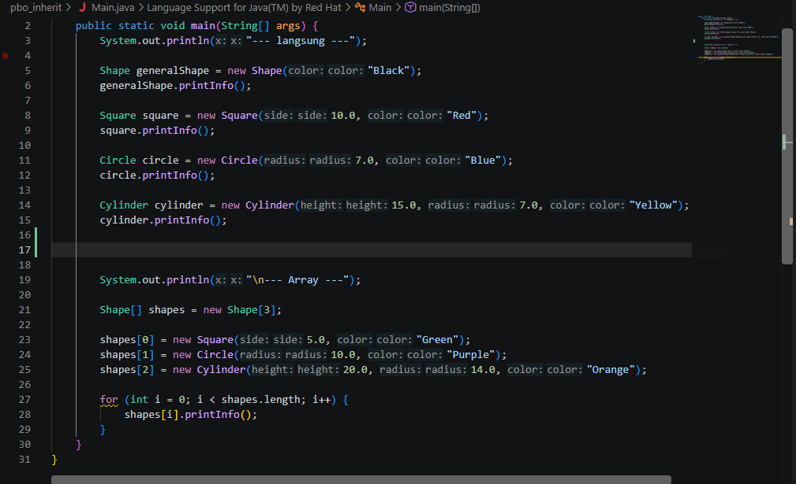
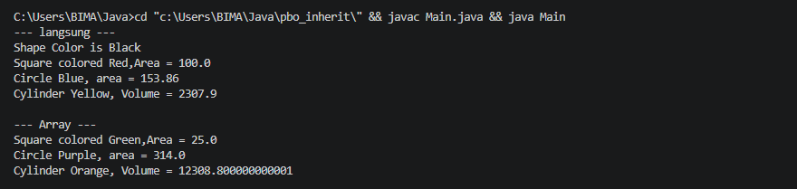

# Shape Inheritance and Polymorphism (Java)

A console-based Java application demonstrating fundamental Object-Oriented Programming (OOP) concepts, specifically inheritance (single and multilevel), method overriding, and polymorphism. The project models geometrical shapes where specialized 2D and 3D shapes inherit shared attributes and behaviors from a base class.

## Project Structure

```text
pbo_inherit/
├── assets/
│   ├── shape.png
│   ├── square.png
│   ├── circle.png
│   ├── cylinder.png
│   ├── main.png
│   └── output.png
├── Shape.java
├── Square.java
├── Circle.java
├── Cylinder.java
├── Main.java
└── README.md
```

## Class Hierarchy

```text
Shape
├── Square
└── Circle
    └── Cylinder
```

- `Square` and `Circle` directly extend `Shape` (single inheritance).
- `Cylinder` extends `Circle`, which in turn extends `Shape` (multilevel inheritance).

## Additional Information & Dependencies

This project relies purely on standard **Java SE (Standard Edition)** libraries. It does not require any external dependencies, package managers (Maven/Gradle), or third-party JAR files.

## Code Explanation

### `Shape.java` (Base Class)

<p align="center">
  
  <br>
  <em>Shape.java source code</em>
</p>

`Shape` is the superclass that defines the common attribute shared across all shapes:

- **Attributes:** `protected String color`. The `protected` access modifier allows direct access to subclasses without breaking encapsulation toward unrelated classes.
- **Constructor:** Accepts a color string to initialize the shape color.
- **Methods:**
  - `getColor()` and `setColor(String color)`: Standard getter and setter for the color attribute.
  - `printInfo()`: Outputs the default information displaying the shape color.

### `Square.java` (Subclass of `Shape`)

<p align="center">
  
  <br>
  <em>Square.java source code</em>
</p>

`Square` extends `Shape` to represent a two-dimensional square:

- **Attributes:** `private double side`.
- **Constructor:** Invokes `super(color)` to delegate color initialization to `Shape`, then sets `this.side`.
- **Methods:**
  - `calculateArea()`: Computes the area using formula $side \times side$.
  - `printInfo()`: Overrides `Shape.printInfo()` to print the square color alongside its calculated area.

### `Circle.java` (Subclass of `Shape`)

<p align="center">
  
  <br>
  <em>Circle.java source code</em>
</p>

`Circle` extends `Shape` to represent a two-dimensional circle:

- **Attributes:**
  - `protected double radius`: Accessible by further specialized subclasses (such as `Cylinder`).
  - `public static final double phi = 3.14`: A constant value for $\pi$.
- **Constructor:** Invokes `super(color)` and sets `this.radius`.
- **Methods:**
  - `calculateArea()`: Computes the circular area using formula $\pi \times radius^2$.
  - `printInfo()`: Overrides `Shape.printInfo()` to display the circle color and calculated area.

### `Cylinder.java` (Subclass of `Circle`)

<p align="center">
  
  <br>
  <em>Cylinder.java source code</em>
</p>

`Cylinder` demonstrates multilevel inheritance by extending `Circle`:

- **Attributes:** `private double height`.
- **Constructor:** Calls `super(radius, color)` to let `Circle` and `Shape` handle radius and color initialization, then sets `this.height`.
- **Methods:**
  - `calculateVolume()`: Uses `super.calculateArea() * height` to reuse base area calculation logic from `Circle`.
  - `printInfo()`: Overrides `printInfo()` to display the cylinder color and its computed volume.

### `Main.java` (Execution Entry Point)

<p align="center">
  
  <br>
  <em>Main.java source code</em>
</p>

`Main` demonstrates two approaches of working with the class hierarchy:

1. **Direct Instantiation:** Creates concrete instances of `Shape`, `Square`, `Circle`, and `Cylinder` individually and invokes `printInfo()` on each.
2. **Polymorphic Array (`Shape[]`):**
   - Instantiates an array of type `Shape[]`.
   - Stores different subclass objects (`Square`, `Circle`, `Cylinder`) inside the array.
   - Iterates through the array and calls `shapes[i].printInfo()`. Java uses dynamic method dispatch at runtime to execute the overridden `printInfo()` version of each respective subclass.

## Concepts Demonstrated

- **Inheritance:** Code reuse where common data (`color`) and base methods reside in `Shape`, while subclasses add specific geometric attributes (`side`, `radius`, `height`).
- **Multilevel Inheritance:** `Cylinder` inherits properties and methods from both `Circle` and `Shape`.
- **Method Overriding:** Each subclass supplies its own specific implementation of `printInfo()`, annotating it with `@Override`.
- **Polymorphism:** Storing heterogeneous objects in a single `Shape[]` array and invoking overridden methods uniformly through the base type reference.

## Program Output

<p align="center">
  
  <br>
  <em>Terminal execution output of Main.java</em>
</p>

```text
--- langsung ---
Shape Color is Black
Square colored Red,Area = 100.0
Circle Blue, area = 153.86
Cylinder Yellow, Volume = 2307.9

--- Array ---
Square colored Green,Area = 25.0
Circle Purple, area = 314.0
Cylinder Orange, Volume = 12308.8
```